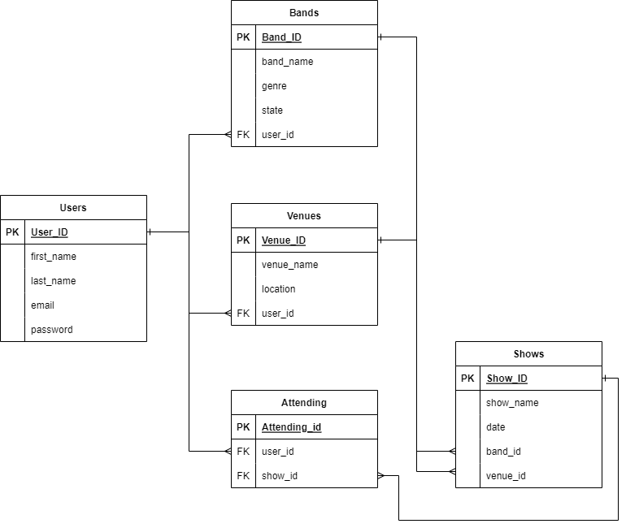

# API Webserver Project

## Liam Massey - T2A2

***

### R1 + R2) Identify the problem you are trying to solve by building this app, Why is it a problem that needs solving?

My project is built to create a central location for bands and venues to post upcoming shows and for users to be able to mark themselves as attending the show. I believe this is a solution to the problem where in the local music scene there isn't really a centralized platform that is solely focused on shows. Often you need to follow bands or venues, periodically checking for updates when new shows are happening.  

***

### R3) Why have you chosen this database system. What are the drawbacks compared to others?

***

### R4) Identify and discuss the key functionalities and benifits of an ORM  

***

### R5) Document all endpoints for your API

***

### R6) ERD

For this entity relationship diagram provided I have defined four entities and one relationship table. The entities are users, bands, venues and shows and the relationship is between users and shows via the attending table. The user table has a relationship with bands and venues as a user is able to create a venue or a band and associate it with their user identity. The user also has a relationship with the shows entity via the attending table, this allows the user to register there attendance by supplying their users identity and the shows identity.  
Bands and Venues have similar relationships with shows where they are able to create a show and either supply the band ID or the venue ID depending on who creates it.  

***

### R7) Detail any third party services that your app will use

***

### R8) Describe your projects models in terms of the relationships they have with each other

The models for this project are:

- User
- Band
- Venue
- Show
- Attending

#### **User**

The User model is the first point of call for this application, as it allows our users to create their own account, create a venue or band account and attend upcoming shows. In the User Model we have 4 attributes and 1 primary key. The primary key is the user_id and is serialized by our database postgresql. For the attributes a user has a first name, last name, email and password, all of these elements are not nullable. The password will also be protected by using password hashing via Bcrypt.  

#### **Band**

The Band model is where users are able to create a band that they currently play in and there is an association between the two with a use of a foreign key that points to the user_id in the users table. The attributes that are related to a band are the band name, the genre of the band(example: punk, pop, metal, electronic) and the state that the band is located in, these are not nullable. A primary key is also supplied as band_id and is serialized by postgresql.  

#### **Venue**

The Venue Model is where users are able to create a venue that hosts the shows, the association between these two is through a foreign key of the user_id. The attributes of a venue are the venue name and location, there is also a primary key for a venue model that is the venue_id and is serialized through postgresql. These attributes are also not nullable.  

#### **Show**

A show model is where bands or venues are able to create a show that is upcoming. They are associated through foreign keys for both band and venue ids. For the Show model its attributes there are the show name, the date and the associated keys. these are also not nullable. A show also has its own unique primary key which is show id and is serialized through postgresql.  

#### **Attending**

***

### R9) Discuss the database relations to be implemented in your application

***

### R10) Describe the way tasks are allocated and tracked in your project

***

### Software Development Plan

***
