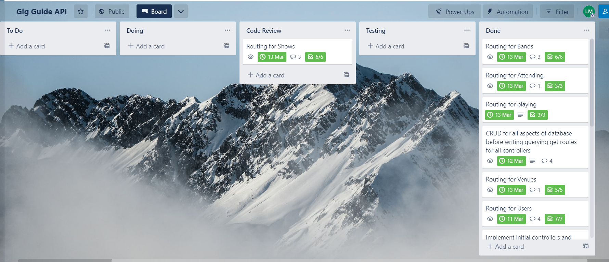

# API Web Server Project

## Liam Massey - T2A2

### [github repo](https://github.com/Liam-M-Dev/gig-guide-api)

***

### R1 + R2) Identify the problem you are trying to solve by building this app, Why is it a problem that needs solving?

My project is built to create a central location for bands and venues to post upcoming shows and for users to be able to mark themselves as attending the show. I believe this is a solution to the problem where in the local music scene there isn't really a centralized platform that is solely focused on shows. Often you need to follow bands or venues, periodically checking for updates when new shows are happening.  

***

### R3) Why have you chosen this database system. What are the drawbacks compared to others?

The database system that I have chosen to use for this project is PostgreSQL. The reason for this decision is because it is a highly advanced open sourced relational database management system. This is beneficial because it has a lot of community support, documentation and continual updates/quality of life improvements. It is also used by some of the bigger companies in the tech industry which gives you confidence in its ability to handle data and relational database management(Panchenko, I. 2021)(1).  
Postgres also offers a pretty robust collection of data types and keeps data integrity viable with the use of constraints and primary/foreign keys. Another reason for the decision of postgres is its performance and security with data and transactions, giving the database some solid methods of keeping data secure, allowing hashed passwords and protecting data from middle man attacks. Whilst also being able to handle multiple transactions at the same time. It also has a solid ability to handle different programming languages making it a versatile database management system(Chiessi, L. 2018)(2).

There are some disadvantages/drawbacks to using postgresql as opposed to some other database systems. For instance postgres has a slower performance than other systems. This can be seen with the querying of results as the system will read through an entire table to be able to locate the relevant data. Obviously this can become an issue when data sets tend to scale up in size. Being open sourced can be an advantage and a disadvantage at the same time, because its open sourced this can result in it having trouble in having its name out in the general forum and doesn't come with liability/warranty protection. This can also result in less skilled people being around that can work on this system.  
Another disadvantage is that the data is not necessarily all that flexible. What I mean by this is that if we have some data and we want to add a new field to this collection. We have to apply this information into each existing data row even if we don't have information to store into pre-existing instances for the new field(Dhruv, S. 2019)(3).

***

### R4) Identify and discuss the key functionalities and benefits of an ORM  

Using Object Relational Mapping gives us access to some core functionalities that benefit the development and usage of an API.  

- Data Persistency: ORM's allow a way of to persist data to a database without the need of writing SQL code manually. This helps to abstract away the details of database operations and simplify the ways to interact with a database.
- Querying: ORM's provides a solid way to query a database with the ability to implement high level relational orientated syntax. This provides a simpler and more refined way of querying data through the databases without the need of writing your own SQL queries.
- Relationships: Relationships are a key functionality of ORM's as it helps to define and manage relationships between the objects within an application and tables in the database. This gives developers a way to define and associate relationships such as one to one, one to many and many to many.
- Mapping: ORM's are able to map the data in databases in the forms of objects within the application. this gives the developer more freedom to write effective functions and methods that interact with the database, rather than relying on writing SQL statements.
- Validation: With the use of things like schemas, ORM's give us a way to validate the data before adding it within the database. This frees up a lot of time and effort, and provides a way to ensure that the data is correct, consistent and meets the criteria before being added to the database(Pedamkar, P. 2022)(4).

Additionally some of the key benefits of using an ORM are

- Simplifies the database access by providing an abstraction layer between the database and the application. Allowing the interaction with the database through object orientated syntax giving it a more robust and intuitive access.
- ORM's give developers independence from the database. This saves a lot of time and gives the developer options when/if the database system needs to be changed/switched. Not having the language tied to one system gives database flexibility.
- ORM's provide a level of consistency by having standardized ways of accessing, updating, deleting and creating data. This helps to reduce errors and inconsistencies that can appear when using SQL statements.
- Productivity is increased with the usage of ORMs by reducing the amount of boilerplate code needed to be written to interact with the database. Giving developers more time to focus on the applications logic rather than implementation(Zelinsky, A. 2022)(5)(Makai, M. 2022)(6).

***

### R5) Document all endpoints for your API

#### **_Before you start_**

#### **Directory/Python setup**

To be able to run this API on your computer follow these instructions for installation and set up, then there is a detailed list of all the API endpoints, their expected results and errors and methods that are used within the routes.  

Installation requirements: You will need to ensure you have Python 3.10 and up and PostgreSQL installed on your device.  

To begin with clone this repo and then create a virtual environment and activate the environment by running these commands in the src directory:

```bash
python3 -m venv .venv
source .venv/bin/activate
```

Once activated we have one more step with the python side of things to ensure everything is installed. Please run the install command with the requirements.txt file:

```bash
pip install -r requirements.txt
```

This will install all the required third party dependencies/libraries that are needed to run this application.

#### **PostgreSQL setup**

To set up the database so that the flask API application can run smoothly you will need to do a couple things.  
Firstly you need to create the database that this application will be connected too.  

```SQL
CREATE DATABASE gig_guide_api;
```

Once the database is created we need to assign a user to the database, to allow for the database URI to be connected, to do this we will make a user called "gig_dev" with a password of "music123" and give the gig_dev user all permissions on the database and all permissions to the public schema.

```SQL
CREATE ROLE gig_dev WITH PASSWORD 'music123';
GRANT ALL PRIVILEGES ON DATABASE gig_guide_api TO gig_dev;
GRANT ALL ON SCHEMA public TO gig_dev;
```

#### **Create, Seed and Drop the database**

Once everything is setup and installed we can start the API by creating the database, seeding it with seeds and dropping the database to ensure we can clear the data. Then we can recreate the database and seed it to start using the API's functionalities/features.  
The commands to run this are:  

```python
flask db create
flask db seed
flask db drop
```

This will create, seed and drop the database. Ensuring that everything is working this is the final set up of the API. Next we re-run ```flask db create and flask db seed```, then finally to create the app and start it up type ```flask run``` in the command terminal.

#### **API end points documentation**

_To work with this api you will need to be either using postman or insomnia, for the examples shown it will be via insomnia._

_Before jumping into the full functionality of this API, it is recommended to login with a few of the seeded users to make it easier to navigate when authentication is required. Here you can save the tokens somewhere so that you can re-use them whilst exploring the API._

#### **User_controller endpoints**

#### user login endpoint

#### route = localhost:5000/users/login **"POST"**

This route allows users to login to the API and returns a unique JWT access token that has an expiry for 1 day. This is used to then do further authentication and querying Users from the database table "USERS". The route takes input through postman or Insomnia in the the data form of JSON. Requires a user_email and user_password. Requests are to be made like this

```JSON
{
    "user.email" : "example.email.com",
    "user.password" : "example.password",
}
```

A successful response will look like this


If the email or password is incorrect the response will be


#### users endpoint

#### route = localhost:5000/users/  **"GET"**

the users endpoint allows the admin user to receive a list of JSON objects that contain each user that is stored in the database. It requires the user to put their JWT token into the bearer auth token. This will either confirm if the user is an admin or not.  

A successful response will return


An unsuccessful response will return


#### display single user endpoint

#### route: localhost:5000/users/display/user **"GET"**

Display user endpoint allows a user to view their user information that is stored in the database. This information is returned back in a JSON object format that includes the users first and last name in string format, their user Id as an Integer, their email as a string, a boolean telling them if they are an admin or not, a hashed password and any nested attending shows via their relationship with shows through the attending table. This input requires the JWT token a user is assigned upon registration or login and the users ID in the route header, if the incorrect id is given an error will occur.  

A successful response will return


An unsuccessful response will return


#### Users attending show

#### route = localhost:5000/users/attending/show  **"GET"**

Attending show endpoint allows users to see who is attending what upcoming shows. get request method queries attending objects within the attending table and returns attending instances as JSON object format in a list. Displays the user id, show id and the id of the attending object.  


#### User registration endpoint

#### route = localhost:5000/users/register  **"POST"**

Register route for users allows a user to essentially create an account. The route will handle creating a new user object and saving it within the database. The user will need to fill out the required fields win the response body in a JSON object format. This will need a first and last name, a user email, a password of 8 characters in length and will automatically input the user as not an admin.  

A successful input and response is


If the email is already in use a response like this will be made


#### Attending register endpoint

#### route = localhost:5000/users/attending/register **"POST"**

Attending register route allows a user to register their attendance to an upcoming show. This is done by inputting the users JWT to authenticate and return the valid user object. The user then puts in the request body in JSON object format the show_id that they wish to attend. Returns the newly created attending object, which consists of a unique id, the band id and show id.


#### Update user endpoint

#### route = localhost:5000/users/update **"PUT"**

Update route allows a user to update there user details that are stored within the users table. To access this the user will need an authenticated JWT token which will query the user object and return this back to the route function. The user can update their details within the body of the request in JSON object format. The updated details will the replace the old details in the user object, commit this to the database and return the updated users details for viewing.


#### Delete user endpoint

#### route = localhost:5000/users/delete **"DELETE"**

Delete endpoint allows a user to remove their details from the database. This can also be done by an admin user. Route takes the user id integer to query user object from database and checks that the user id matches with the user id that is currently logged in. If there is not a match an error will be thrown with 401 code, otherwise the user will be deleted from the database.


#### Remove attendance endpoint

#### route = localhost:5000/users/attending/remove/int:attending_id  **"POST"**

Remove attendance allows the user to remove there attendance from an upcoming show. This is done by taking the users JWT token and authenticating the user, then taking an integer from the routes header to match the attending_id. It will get an error if there is no exisiting attendance record or if the users_id does not match the attendance records user_id.


#### **Band Endpoints**

#### Bands endpoint

#### route = localhost:5000/bands/  **"GET"**

Displays a list of all the band objects within the bands table. Returns a JSON object format and requires no input apart from sending the initial bands route request. Also display's nested relationships with shows and playing, this is so that users can see what upcoming shows the band has created or are playing in.


#### Display single band endpoint

#### route = localhost:5000/bands/display/band/int:band_id **"POST"**

Route uses band id integer to query band object from database table bands. Returns 404 error if no band is found. If the band does exist, band object is validated and serialized through the schema and displayed in JSON object format. Upcoming shows that band created and are playing are nested within schema.


#### Display search bands endpoint

#### route = localhost:5000/bands/search **"GET"**

Route uses queries within the routes headers to search for bands with similar genres or similar states. returning an error if the request goes beyond the parameters. Returned responses are of the queried band objects in JSON object format.  
Band objects contain the bands name, genre, state all as strings, also includes the bands unique ID number as an integer. Nested shows with the show name and id are also displayed.


#### Playing endpoint

#### route = localhost:5000/bands/playing **"GET"**

Simple get request to display a list of all the playing objects within the playing table. The playing objects consist of a unique id, a band id and a show id all integers. This helps represent the many to many relationship with shows and bands.


#### Band creation endpoint

#### route = localhost:5000/bands/create  **"POST"**

Band creation takes the users JWT access token to authenticate and return validated user from database. User will input in the body of the request in JSON format the bands_fields, which associates the fields with attributes of the schema and model and allows for validation. This will also check if the band name exists within the system. When all checks pass, the band is added into the database table bands and returns the newly created band with all of its attributes in JSON object format.  


#### Band update endpoint

#### route = localhost:5000/bands/update/int:band_id **"PUT"**

The update route allows a band to update its details. This is done by getting the user from the users JWT access token, and the band from the database by querying the band_id through the band objects in bands. The function then checks if both the user object and band object have matching user_ids. Returning and error if there is not a match. If there is a match then the band updates its fields by taking input from the request body which includes the band name, genre and state. The function then commits the band to the database and returns the updated band information as a JSON object to view.


#### Band deletion endpoint

#### route = localhost:5000/bands/delete/int:band_id  **"DELETE"**

This endpoint allows a user to remove a band that they are associated with from the bands table within the database. It requires the JWT access token to authenticate and return the validated user object. The bands id which is used to query the band within the database and return a validated band object. The user Id and band user_id are then checked to ensure user has access to the band, the only overriding possibility is if the user is an admin. Band is then removed from the database and a message is returned with the message code 200


#### Register band to show via playing endpoint

#### route = localhost:5000/bands/playing/register/int:band_id **"POST"**

Playing register endpoint allows bands to sign themselves up onto an upcoming show. This stores the information of band+id and show_id in a row within the playing table. Returning the playing object back to the viewer with the information stored as a JSON object.


#### Remove band from show via playing endpoint

#### route = localhost:5000/bands/int:band_id/int:playing_id **"DELETE"**

Remove endpoint that allows a band to remove itself from the bill of an upcoming show. This is handled by getting the user id from a JWT token to check authorization of band. the band object and playing object are queried through the inputted integers in the route header, and are checked to see if playing.band_id is the same and the band_id. Returning and error if they are not. If they are a match then playing object is removed from playing table and message is returned with 200 code.


#### **Venue Endpoints**

#### Venue list display

#### route = localhost:5000/venues  **"GET"**

venues endpoint that allows the viewing of the list of venues that are stored within the database. Venue information is the venue name, the venue location as strings, also features the nested user that owns the venue with their first and last name as strings. List is returned as a JSON objects.  


#### Venue single display endpoint

#### route = localhost:5000/venues/display/venue/int:venue_id

Venue single display route allows the user to view a single venue and the upcoming shows that are associated with that venue id. Using an integer submitted by the user within the header, the function queries the venue object that has that id number as its primary key and stores the venue object into a variable. using the venue's id number the function also queries any upcoming shows and stores them within another variable. Using schemas the venue and show are then serialized into displayable JSON objects and returned to the user.


#### Venue register endpoint

#### route = localhost:5000/venues/register  **"POST"**

Venue register allows a user to create a venue that they own or work for. This is done by getting the authenticated user from their JWT token. Taking the request body in JSON object format, the method processes the venues details, which is the name of the venue in a string format, the location of the venue also in a string format and assigns it a unique primary key in integer format. The object is then serialized and stored into the venues table and also returned completed for the user to view


#### Venue update endpoint

#### route = localhost:5000/venues/update/int:venue_id  **"PUT"**

Venue update endpoint allows a venue to update its venue name and venue location with new information. Takes the JWT access token of a user to verify the user has access to the venue. Then using venue ID queries the venue object from the table of venues. Using the request body and as JSON data, the venue name and location can then be changed. Errors will be thrown if the user does not have access or if the data is missing fields that need to be associated with the models attributes.  


#### Venue delete endpoint

#### route = localhost:5000/venues/delete/int:venue_id  **"DELETE"**

Venue delete route allows a venue to be removed from the venues table within the database. Function gets passed the user object from a submitted JWT token and queries the venue using the venue_id within the request header. Function checks if the user has access to the venue to allow it to be removed. Throws an error if the user does not have access along with the error code 401, only way to override this is if the user is an admin user. If the checks clear then the function removes the venue from the database and returns a venue deleted message with 200 code.


#### **Show Endpoints**

#### Shows display endpoint

#### route = localhost:5000/shows/  **"GET"**

Simple method to return a full list of the upcoming shows from within the shows table in the database. function queries all of the show objects that are stored within the shows table, runs them through the schema for serialization and validation and returns list of show objects as JSON object format for the viewer.


#### Show display endpoint

#### route = localhost:5000/shows/display/show  **"GET"**

Show display route allows for a single show to be displayed with the venue it is associated with along with the venues location. The Show is queried through the shows table using a primary key that is received from the routes header. If the show does not exist an error is thrown and a message plus the error code 400 is sent back to the user. The venue is queried by using the show's venue_id attribute. If no venue object is found within the venues table, an error is thrown with a message and a error code 400. If both objects are succesfully queried then the show and venue are run through their schemas for validation and serialization, and returned to the user as JSON objects.


#### Shows search endpoint

#### route = localhost:5000/shows/display/search  **"GET"**

Search endpoint for shows to allow a user to search between shows that are at the same venue or to search for shows created by a certain band. The method uses the query requests from the route to allow a user to select either band and the bands id or venue and the venue id. If something incorrectly chosen an error will be thrown to let the user know to search between bands and venues only. Show objects are then queried by either matching shows with band id or venue ids to the request id. Once shows are queried the objects are serialized and displayed as JSON objects only displaying the show name and date.


#### show creation

#### route = localhost:5000/shows/create/show  **"POST"**

Show creation route allows venues and bands to create an upcoming show and store it within the shows table. To do this a request needs to be made to query either if a band or a venue is making this show along with their associated id. A user JWT token is needed to be sent in the authorization header to confirm that band or venue making the request is coming from the authorized user. Using the show_fields a venue or band is then able to put the show name, show date, and venue/band id in the request body. It only needs one the id of the band if a venue is creating the show or the id of a venue if the band is creating the show. Data is then serialized through the show schema, and stored within the database table shows. A returned JSON object of the shows data is sent back to the user


#### Show update endpoint

#### route = localhost:5000/shows/update/show/int:show_id  **"PUT"**

Update endpoint allows the band or venue to update a shows information such as needing to change the date or the show name. To do this the user is grabbed from a JWT to ensure the band or venue is being used by an authorized user. Inside the request queries either a venue or band with its id, similar to how a show creation is made, this helps dictate either a band or a venue is updating the show and ensure band or venue have access to the show. The same process with a body in the request that has JSON data as the format and fills in the show_fields to the newly updated information. This then serializes the updated show and commits it back to the database and returns an updated form of the show to the user as a JSON object.


#### Show delete endpoint

#### route = localhost:5000/shows/delete/show/int:show_id  **"DELETE"**

Show delete route allows a band or venue to remove the show from the shows table. The method utilizes the same search request to query a venue or band object from the users choice, whilst also gathering the users JWT token to ensure that the band or venue is authorized to delete the show. A show is queried from the request header using int:show_id the show id is then checked with either the band or venue id depending on which one is executing the delete process of the show. If any of the checks do not pass an error will be thrown with a 401 code. If all checks pass then the show is deleted from the shows table and a message is returned with a 200 code.  


***

### R6) ERD


For this entity relationship diagram provided I have defined four entities and two relationship table. The entities are users, bands, venues and shows and the relationship tables are attending and playing. The user table has a relationship with bands and venues as a user is able to create a venue or a band and associate it with their user identity. The user also has a relationship with the shows entity via the attending table, this allows the user to register there attendance by supplying their users identity and the shows identity.  
Bands and Venues have similar relationships with shows where they are able to create a show and either supply the band ID or the venue ID depending on who creates it. To reduce duplication of data bands also have a many to many relationship that is associated in the playing table. This allows other bands to add themselves to the bill of a show without creating a similar entity within the shows table.  

***

### R7) Detail any third party services that your app will use

- Flask: Flask is a lightweight web framework(often described as a micro framework), which allows developers to build effective web applications and API's. Flask provides only the essential components for web development and is highly customizable. Flask is modular, lightweight, has multiple flask-extensions, solid documentation, provides an inbuilt routing system and is RESTful API supported(flask documentation. 2022)(7).
- flask-sqlalchemy + SQLAlchemy: Flask-sqlalchemy is a library that provides integration between the flask app and the SQLalchemy object-relational mapper. This is a popular library that allows developers to implement code that interacts with the database through python. It features data abstraction, simplified database access, integration with flask and flask-extensions, flexible and provides great performance(flask-sqlalchemy documentation. 2022)(8).
- flask-marshmallow + Marshmallow: Flask-Marshmallow provides integration between a flask app and the Marshmallow library. This is a popular way to serialize and deserialize data in python.  flask-Marshmallow allows for schema definition, automatic validation, seamless integration with flask, support for multiple data formats including JSON, YAML etc, customizable and integrates with other flask-extensions/libraries(flask-marshmallow documentation. 2022)(9)
- flask-bcrypt: flask-bcrypt is a flask extension that allows the integration between flask webb apps and bcrypt, which is a popular python library for password hashing/salting. Making passwords more secure and difficult for attackers to crack user passwords. It features flask integration, password hashing and salting, password verification, and high performance(flask-bcrypt documentation. 2022)(10).
- flask-jwt-extender: flask_jwt_extender is a flask extension that provides integration with PyJWT library, a library that is used for JSON authentication and authorization. Features are the JWT authentication, integration with flask, token creation and verification, customization and token expiration and refresh(flask_jwt_extender documentation. 2022)(11).
- Insomnia/postman: Insomnia and postman are tools that are used to develop the api, providing a graphical interface for sending http requests and viewing the responses generated. Giving the a developer an easy way to test and debug the API.  

***

### R8) Describe your projects models in terms of the relationships they have with each other

The models for this project are:

- User
- Band
- Venue
- Show
- Attending
- Playing

#### **User**

The User model is the first point of call for this application, as it allows our users to create their own account, create a venue or band account and attend upcoming shows. In the User Model we have 5 attributes and 1 primary key. The primary key is the user_id and is serialized by our database postgresql. For the attributes a user has a first name, last name, email, password, and admin all of these elements are not nullable. The password will also be protected by using password hashing via Bcrypt. Admin is a boolean that is default set to False, The admin attribute helps to define if a user is an admin and grants the user some extra abilities such as removing a profile not linked to themselves.

#### **Band**

The Band model is where users are able to create a band that they currently play in and there is an association between the two with a use of a foreign key that points to the user_id in the users table. The attributes that are related to a band are the band name, the genre of the band(example: punk, pop, metal, electronic) and the state that the band is located in, these are not nullable. A primary key is also supplied as band_id and is serialized by postgresql.  

#### **Venue**

The Venue Model is where users are able to create a venue that hosts the shows, the association between these two is through a foreign key of the user_id. The attributes of a venue are the venue name and location, there is also a primary key for a venue model that is the venue_id and is serialized through postgresql. These attributes are also not nullable.  

#### **Show**

A show model is where bands or venues are able to create a show that is upcoming. They are associated through foreign keys for both band and venue ids. For the Show model its attributes there are the show name, the date and the associated keys. these are also not nullable. A show also has its own unique primary key which is show id and is serialized through postgresql.  

#### **Attending**

Attending model is to represent the relationship between a user and shows. It is made up of a primary key for the attending_id, and 2 foreign keys the user_id and the show_id, which are both not nullable.  

#### **Playing**

Playing Model is to represent the relationship between shows and bands, whereas to allow bands to add themselves to the bill of an existing show. It is made up of a primary key and 2 foreign keys band_id and show_id, which are both nullable.

***

### R9) Discuss the database relations to be implemented in your application

The relations that are implemented are as follows:  

- Users has a one to many relationship with bands, this is because one user is able to have many bands under their ID. This is shown through the ERD with the band model having a foreign key that points to a user_id. This is a reality in the real world because being a musician allows you to play for multiple bands with different genres or the same genre.
- Users have a one to many relationship with venues, as one user can own multiple venues. This is shown through the ERD by implementing a user_id as a foreign key inside the venue model that helps point a venue back to a user within the users table. In the real world often multiple venues can be owned by the same person and I was wanting to reflect that within my API.
- Users also have a many to many relationship with shows, that is associated within the Attending table via foreign key within the model. You can see this represented in the ERD with the one to many line connecting users to the attending table. This reflects reality as a person is able to book themselves into multiple shows.  
- Bands have a one to many relationship with the shows. this is represented through the ERD with the one to many connection and a band_id associated within the show model. This allows bands to create multiple shows however a band cannot create the same show at the same venue on the same date. This is reflected in the real world as bands tend to play multiple shows on a night or over a period of time, or they may play the same show at different venues.
- Bands also have a many to many relationship with shows through the playing table, this is represented within the ERD with the many to many connection to the playing table. This allows multiple bands to sign onto the bill of a show and reduces data duplication within the shows table.
- Venues have a one to many relationship with shows that is associated within the show table as a one to many line on the ERD. This points a show to a venue_id via a foreign key. In reality venues often have multiple shows on during the week and on the same night, to help differentiate the shows this allows a connection to which venue is hosting what gig and which bands will be playing that gig.
- Shows has a many to many relationship with users that is associated within the attending table as well. You can see this represented within the ERD. The attending table allows many shows to be associated to many users through the foreign keys within the attending model.

***

### R10) Describe the way tasks are allocated and tracked in your project

#### [Trello gig_guide_api Kanban board link](https://trello.com/invite/b/lOKHVxJ7/ATTI64452f13177b335a9bf1e6eb7c4c87ec89C06397/gig-guide-api)

For this project I decided to use Trello boards with a kanban style set up of the cards. In each card there is often checklists to check off as I am going through this project, I have set realistic dates to achieve these by that allows for time to make sure everything is running smoothly towards the end of the project.

The initial phase of the setup is done through a few various cards which are, the create virtual environment card, set up postgresql card - setting dates for these as the 2nd of March. My next step is to create the main application file, main.py, creating a config file and connecting that to the main app function. Also have the set up for the .env and .flask-env files. These cards have set dates for the 4th of March to be completed.  

I have created a card for creating the models of my project, each model has checklists to be completed within in them. The checklists include setting up the fields of the model, defining the primary key and defining the relationships that are represented between the models. For the models card I have set the date for completion on the 5th of March.  

Schemas are also defined in the schema card with checklists for each schema to ensure that it is completed and covers what is needed. Inside each checklist I have to implement the fields for each schema, implement the nesting of relationships that is appropriate through marshmallow and its functions such as fields, list etc. This is also set to be completed on the 5th of March.  

Creating CLI commands is my next task to ensure that the connection between the database and the flask app is working as intended. To do this I have set out a checklist to ensure that I create a function to create the database, drop the database and seed the database with information of 5 users, 5 bands, 5 venues, 10 shows and 4 attending. The intention is to have this done by the 6th of March.  

Once CLI commands are finalized within the app, I am going to create my initial setup of controllers. This is tracked via the controllers card, which has a checklist for each individual controller and for the init.py file. Within the init.py file I have a checklist to ensure each controller is added to the registerable controllers, and then implemented into the main app function. Each individual controller has a check list that ensures the blueprints are created and an initial get route to display the information for each table. This will be tracked with the use of Insomnia to ensure that the results are produced correctly. The due date for this is the 7th of March.

The next task is to initialize the routing and implement all the functions and features that I am intending to have related to the databases.  
To begin the process I have a card representing the routing for Users, With a checklist that ticks off the CRUD features, creating a user, reading users, updating users and deleting users, ensuring there is also appropriate authentication and validation and implementing searching functions to allow show the user what venues or bands are connected to their ID. Implementation plan of this is to have it done by the 8th (extended to 12th).  
Routing for bands is the next one on the list and follows a similar line of checking the CRUD features, also creating search features to show bands with their upcoming shows, similar genres and states and displaying bands that have connected user IDs.  
Routing for venues is the next card to check off that follows the same principals as before with CRUD features and displaying shows that are upcoming associated with the venue as well as displaying user ids that connect to the venues.  
Routing for Shows again follows similar CRUD principals allowing a venue or band to create, update, read and delete upcoming shows. It also has features to display shows that are connected to one venue or shows that are connected to one band.  
The Attending routing is done through users which gives users the ability to add themselves as attending to a show, delete their attendance to a show and update their attendance to a different show. It also allows displaying of users going to a single show and shows that one user is selected to attend. These routes are all intended to be finalized by the 12th of March.  
Finally the last cards are for the documentation that is intended to finish up by the 17th of March. To have all the coding finished by the 12th is my ideal mission as this allows for testing to ensure everything is being handled appropriately, error handing is completely covered and if any features need editing or adding.  

#### **UPDATES**

Whilst working on this project some of the timelines reflected in the intial planning stages had been changed and is reflected within the Trello board linked to the page. Specifically routing was extended to the 13th of March. Updated details are also within the Trello board, the implementation of a playing table was something that become developed back into application whilst working on the bands and shows routing. Realizing that I needed to show a many to many relationship to help with data normalization. The playing table was modelled in and had a card designed for the routing, which allows for adding and deleting a playing instance. Other additional cards were made towards the end of the project, which are in relation to error handling, implementing dry principals and fixing code to be more readable and follow pep-8 guidelines. These are all reflected in the linked trello board. There are also screenshots below to reflect the development process.  

***

### Software Development Plan Images





***

### References

- (1): _Panchenko, I. 2021. PostgreSQL benefits and challenges: A snapshot. <https://www.infoworld.com/article/3619531/postgresql-benefits-and-challenges-a-snapshot.html>_
- (2): _Chiessi, L. 2018. Why Should I use PostgreSQL as Database in my Startup/Company. <https://medium.com/we-build-state-of-the-art-software-creating/why-should-i-use-postgresql-as-database-in-my-startup-company-96de2fd375a9>_
- (3): _Dhruv, S. 2019. Postgresql Advantages and Disadvantages. <https://www.aalpha.net/blog/pros-and-cons-of-using-postgresql-for-application-development/>_
- (4): _Pedamkar, P. 2022. What is ORM?. <https://www.educba.com/what-is-orm/>_
- (5): _Zelinksy, A. 2022. What is Object-Relational Mapping. <https://medium.com/@alexzelinsky124/what-is-object-relational-mapping-orm-4b7d98bbb16f>_
- (6): _Makai, M. 2022. Object-Relational Mappers. <https://www.fullstackpython.com/object-relational-mappers-orms.html>_
- (7): _Flask documentation. 2022. <https://flask.palletsprojects.com/en/2.2.x/>_
- (8): _Flask-sqlalchemy documentation. 2022. <https://flask-sqlalchemy.palletsprojects.com/en/3.0.x/>_
- (9): _Flask-Marshmallow documentation. 2022. <https://flask-marshmallow.readthedocs.io/en/latest/>_
- (10): _Flask-bcrypt documentation. 2022. <https://flask-bcrypt.readthedocs.io/en/1.0.1/>_
- (11): _Flask-JWT-Extender documentation. 2022. <https://flask-jwt-extended.readthedocs.io/en/stable/>_
